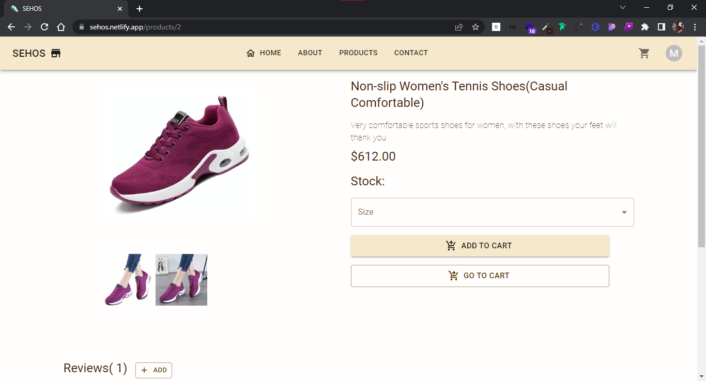

[;Welcome+to+my+GitHub+Profile>)](https://git.io/typing-svg)

<h1 align="center">Hola 👋, soy Joel Orzet</h1>
<h3 align="center" style="margin-bottom: 35px;">Web Developer de Argentina</h3>

- 💬 ¿Quién soy yo? **Soy un apasionado por el desarrollo web y la logica de programación con el deseo constante de aprender y trabajar en equipo.**

- 🤔 Algunos de mis hobbies: **Video juegos online, Tocar la guitarra, Escuchar música, Cocinar 😀**

- 📝 ¿Quieres contactarme? **Puedes hacerlo a través de Linkedin [in/joelorzet](https://www.linkedin.com/in/joelorzet) o vía email [joelorzt@gmail.com](mailto:joelorzt@gmail.com)**

<h3>- Contacto:</h3>

✉️ **Email:** [joelorzt@gmail.com](mailto:joelorzt@gmail.com)  
🌐 **LinkedIn:** [in/joelorzet](https://www.linkedin.com/in/joelorzet)  
🌐 **GitHub:** [github.com/joelorzet](https://github.com/joelorzet)  
🌐 **Portfolio:** [joel-orzet.netlify.app](https://joel-orzet.netlify.app)

---

### - Principales Habilidades:

<table style="border-collapse: collapse; border: 0;">
  <tr>
    <td></td>
    <td><b>Angular</b></td>
  </tr>
  <tr>
    <td></td>
    <td><b>Docker</b></td>
  </tr>
  <tr>
    <td></td>
    <td><b>NestJs</b></td>
  </tr>
  <tr>
    <td></td>
    <td><b>Testing (Cypress, Jest, Supertest)</b></td>
  </tr>
</table>

<h3 align="left">- Herramientas y lenguajes con los que he trabajado: </h3>

<h4>* Lenguajes de programación y marcado:</h4>

<h4>* Bibliotecas y Frameworks Frontend:</h4>

<h4>* Backend y Servidores:</h4>

<h4>* Base de Datos:</h4>

<h4>* Herramientas de Desarrollo:</h4>

<h4>* Servicios y Plataformas AWS:</h4>

# 👨‍💻 Mis proyectos:

## SEHOS 

          

Este es un proyecto grupal hecho junto a otros 7 integrantes cuyo principal objetivo fue el cierre del bootcamp #SoyHenry. Se utilizo la metodologia Scrum para el desarrollo donde mi participacion se enfocó en la coordinacion del equipo, unificacion pesonal, creacion de funcionalidades tanto en el backend como en el frontend, el sistema inicio de sesión con terceros y guarda de compras, cambio de contraseñas, gestión de usuarios como administrador del sitio, entre otras actividades.

 El proyecto presentado nace de la necesidad de otorgar una solución a empresas que se vieron afectadas por el aumento de restricciones presenciales en tiempos de pandemia hacia el consumo de productos de vestimenta orientados a la moda permitiendo así el ingreso de compañias al mercado virtual ayudando al libre comercio y competitidad sana entre comerciantes.

El mismo cuenta con un sector de administración en el cual el dueño puede gestionar de manera eficaz la tienda facilitando su uso y maximizando sus recursos disponibles 

Algunas de sus funciones de administración son: 

<ul>
<li>Cambiar el stock</li>
<li>Dar de baja ciertos productos</li>
<li>Agregar productos</li>
<li>Modificar valores</li>
<li>Cambiar precios, cantidad</li>
<li>Dar de baja usuarios</li>
<li>Dar de alta usuarios</li>
<li>Agregar administradores</li>
<li>Eliminar administradores</li>

</ul>

Algunas de sus funciones de usuario son: 

<ul>
<li>Visualizar productos</li>
<li>Ver el detalle de un producto</li>
<li>Compartir un producto</li>
<li>Agregar al carrito</li>
<li>Agregar producto a Favoritos</li>
<li>Visualizar Favoritos y/o Carrito en otro dispositivo una vez iniciado sesión</li>
<li>Modificar el carrito</li>
<li>Registrarse en la tienda</li>
<li>Iniciar sesión con terceros (Cuenta Google)</li>
<li>Modificar sus datos personales y borrar su cuenta si lo desea</li>
<li>Recuperar contraseña</li>
<li>Facilidad de pagos - pagos con tarjeta de credito mediante Stripe</li>
</ul>

<h2> Tambien le compartimos unas imagenes del proyecto</h2>

   

<a href='https://github.com/joelorzet/sehos-client'> 📂 Ver repositorio</a> <a href='https://sehos.netlify.app/home' target='_blank' rel="noreferrer noopener"> 🌐 Ver proyecto </a>

---

## Countries

        

Proyecto individual (PI) requerido para la aprobacion del Bootcamp de Henry. Aqui se pone en prueba los conocimientos adquiridos durante el cursado del bootcamp en lo que respecta creacion de una base de datos relacional, la creacion de un Backend que conecte esta base de datos y la correspondiente conexión con el Frontend para llegar a una SPA completamente funcional.

### Algunas imagenes

   

<a href='https://github.com/joelorzet/countries-client'> 📂 Ver repositorio</a> <a href='https://countries-app-joelorzet.vercel.app/'> 🌐 Ver proyecto </a>

---
